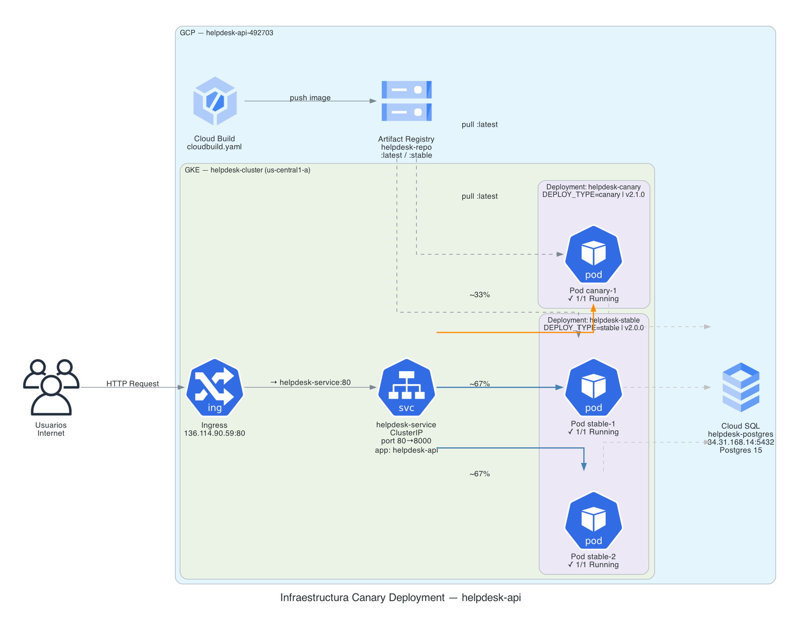

# helpdesk-api

API REST para mesa de ayuda (solicitante, ticket, comentario) usando Django + DRF.

> **Versión stable:** `2.0.0` | **Versión canary:** `2.1.0`  
> **Cluster:** `helpdesk-cluster` — GKE `us-central1-a`  
> **IP pública:** `http://136.114.90.59`

---

## Diagrama de infraestructura



---

## Estrategia de Canary Deployment

Se usa una estrategia de **Canary Deployment basada en proporción de réplicas**:

| Deployment | Réplicas | Tráfico aproximado | Versión | Status |
|---|---|---|---|---|
| `helpdesk-stable` | 2 | ~67% | 2.0.0 | `stable` |
| `helpdesk-canary` | 1 | ~33% | 2.1.0 | `canary` |

### Cómo funciona

1. Ambos Deployments comparten el label `app: helpdesk-api`.
2. El **Service común** (`helpdesk-service`) selecciona todos los pods con ese label, balanceando el tráfico entre los 3 pods en total.
3. El **Ingress** expone el Service al exterior con una única IP pública. Todo el tráfico externo entra por el mismo punto de entrada.
4. La distribución 67/33 emerge naturalmente de la relación 2:1 de réplicas — sin configuración adicional de pesos ni reglas de enrutamiento.
5. Cada pod responde con su propia versión según la variable de entorno `DEPLOY_TYPE` configurada en su Deployment.

### Flujo de tráfico

```
Internet
    │
    ▼
[ Ingress — 136.114.90.59:80 ]
    │  Recibe requests externos y reenvía al Service
    ▼
[ helpdesk-service — ClusterIP ]
    │  selector: app=helpdesk-api
    │  Balancea entre todos los pods disponibles
    │
    ├── Pod stable-1  (DEPLOY_TYPE=stable, v2.0.0)  ┐
    ├── Pod stable-2  (DEPLOY_TYPE=stable, v2.0.0)  ├ ~67% del tráfico
    │
    └── Pod canary-1  (DEPLOY_TYPE=canary, v2.1.0)    ~33% del tráfico
```

### Control de tráfico mediante Ingress

El Ingress actúa como punto de entrada único — recibe el tráfico y lo pasa al Service sin configurar pesos. Es el **Service** quien distribuye el tráfico proporcionalmente al número de réplicas. Esta estrategia se llama **replica-based canary deployment**.

Si se quisiera control exacto de porcentaje independiente de réplicas, se usarían anotaciones nginx:
```yaml
nginx.ingress.kubernetes.io/canary: "true"
nginx.ingress.kubernetes.io/canary-weight: "10"
```

---

## Archivos Kubernetes

```
k8s/
├── namespace.yaml           # Namespace "helpdesk"
├── stable-deployment.yaml   # 2 réplicas, DEPLOY_TYPE=stable, v2.0.0
├── canary-deployment.yaml   # 1 réplica,  DEPLOY_TYPE=canary, v2.1.0
├── service.yaml             # Service común (ClusterIP)
└── ingress.yaml             # Ingress nginx → helpdesk-service
```

---

## Pipeline CI/CD — Cloud Build

El archivo `cloudbuild.yaml` ejecuta automáticamente:

1. **Build** — construye la imagen Docker
2. **Push** — sube la imagen a Artifact Registry con etiquetas `latest` y `stable`
3. **Patch** — reemplaza `PROJECT_ID` en los manifests de k8s
4. **Deploy** — aplica todos los manifests al cluster `helpdesk-cluster`

```bash
# Ejecutar manualmente
gcloud builds submit --config=cloudbuild.yaml --project=helpdesk-api-492703 .
```

---

## Versiones

| Tag | Versión | Descripción |
|---|---|---|
| `v2.0.0` | stable | Versión base con endpoint `/health/` |
| `v2.1.0` | canary | Agrega `deploy_date`, `features_preview` y mejoras de validación |

---

## URLs para validar ambos despliegues

### Health Check — detecta stable o canary

**`GET http://136.114.90.59/health/`**

Ejecutar varias veces para observar la distribución de tráfico.

**Respuesta stable** (~67% de las veces):
```json
{
  "status": "stable",
  "version": "2.0.0",
  "app": "helpdesk-api",
  "environment": "production",
  "timestamp": "2026-06-03T12:00:00.000000+00:00"
}
```

**Respuesta canary** (~33% de las veces):
```json
{
  "status": "canary",
  "version": "2.1.0",
  "app": "helpdesk-api",
  "environment": "production",
  "timestamp": "2026-06-03T12:00:00.000000+00:00",
  "deploy_date": "2026-06-03",
  "features_preview": ["priority-filter-v2", "real-time-ticket-notifications"]
}
```

### Endpoints funcionales

| Método | URL | Descripción |
|---|---|---|
| GET | `http://136.114.90.59/health/` | Health check — stable o canary |
| GET | `http://136.114.90.59/api/v2/tickets/` | Listar tickets |
| POST | `http://136.114.90.59/api/v2/tickets/` | Crear ticket |
| GET | `http://136.114.90.59/api/v2/solicitantes/` | Listar solicitantes |
| GET | `http://136.114.90.59/api/docs/` | Swagger UI |

---

## Monitoreo de la estrategia canary

### 1. Distribución de tráfico en tiempo real

```bash
for i in $(seq 1 15); do
  curl -s http://136.114.90.59/health/ | python3 -c "import sys,json; d=json.load(sys.stdin); print(d['status'], d['version'])"
done
```

Resultado esperado: ~10 respuestas `stable 2.0.0` y ~5 respuestas `canary 2.1.0`.

### 2. Estado de pods en tiempo real

```bash
# Listar pods con track y versión
kubectl get pods -n helpdesk -L track,version

# Logs en vivo del pod canary
kubectl logs -n helpdesk -l track=canary -f

# Logs en vivo de los pods stable
kubectl logs -n helpdesk -l track=stable -f
```

### 3. Consola GCP — Kubernetes Engine

```
https://console.cloud.google.com/kubernetes/workload/overview?project=helpdesk-api-492703
```

- **Workloads** → `helpdesk-stable` (2 pods) y `helpdesk-canary` (1 pod)
- **Services & Ingress** → IP pública `136.114.90.59`

### 4. Cloud Logging — filtros por versión

**Solo logs canary:**
```
resource.type="k8s_container"
resource.labels.namespace_name="helpdesk"
labels."k8s-pod/track"="canary"
```

**Solo logs stable:**
```
resource.type="k8s_container"
resource.labels.namespace_name="helpdesk"
labels."k8s-pod/track"="stable"
```

---

## Variables de entorno

| Variable | Stable | Canary |
|---|---|---|
| `DEPLOY_TYPE` | `stable` | `canary` |
| `APP_VERSION` | `2.0.0` | `2.1.0` |
| `DEPLOY_DATE` | — | `2026-06-03` |
| `ENVIRONMENT` | `production` | `production` |
